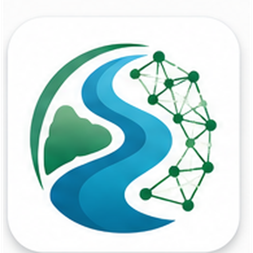
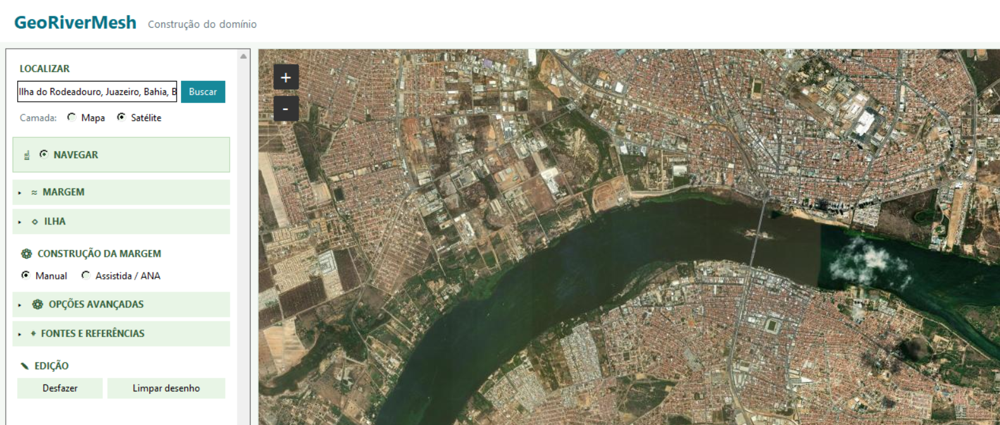

# GeoRiverMesh

  

**Ferramenta para construção de domínios fluviais, georreferenciamento e preparação de geometrias para malhas numéricas.**

## Sobre

O GeoRiverMesh é uma ferramenta computacional desenvolvida para auxiliar na construção e preparação de domínios fluviais destinados a aplicações de modelagem e simulação numérica.

A ferramenta permite trabalhar com dados georreferenciados, construir margens e ilhas, utilizar recursos de marcação manual e assistida e preparar a geometria do domínio para geração de malhas no Gmsh.

  

## Principais funcionalidades

- Visualização por mapa e imagem de satélite
- Construção das margens esquerda e direita
- Identificação e construção de ilhas
- Marcação manual de pontos
- Construção assistida de trechos
- Integração com dados geográficos
- Inserção de pontos por coordenadas
- Importação de pontos
- Salvamento e reabertura de projetos
- Exportação da geometria para o Gmsh (`.geo`)
- Preparação de domínios para geração de malhas numéricas

## GeoRiverMesh Desktop

**Versão atual:** 1.0

O GeoRiverMesh Desktop foi desenvolvido para Windows.

O instalador da versão mais recente está disponível na seção **Releases** deste repositório.

## Autoria

Desenvolvido por **Tuanny Maciel**.

## Status

O GeoRiverMesh encontra-se em desenvolvimento e novas funcionalidades poderão ser incorporadas em versões futuras.
